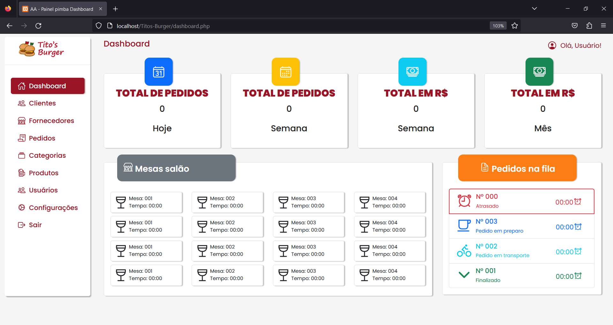
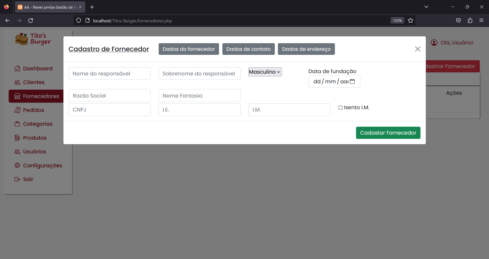
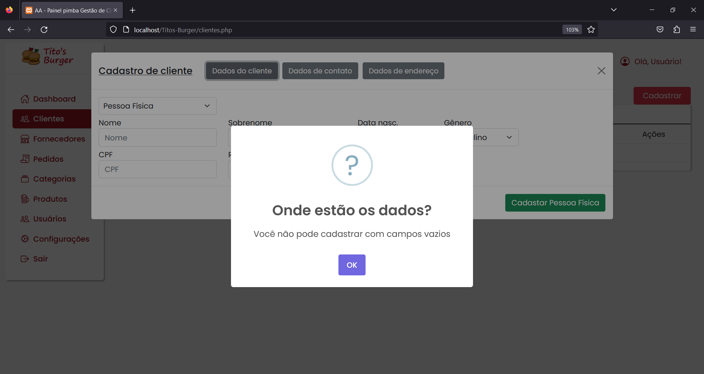
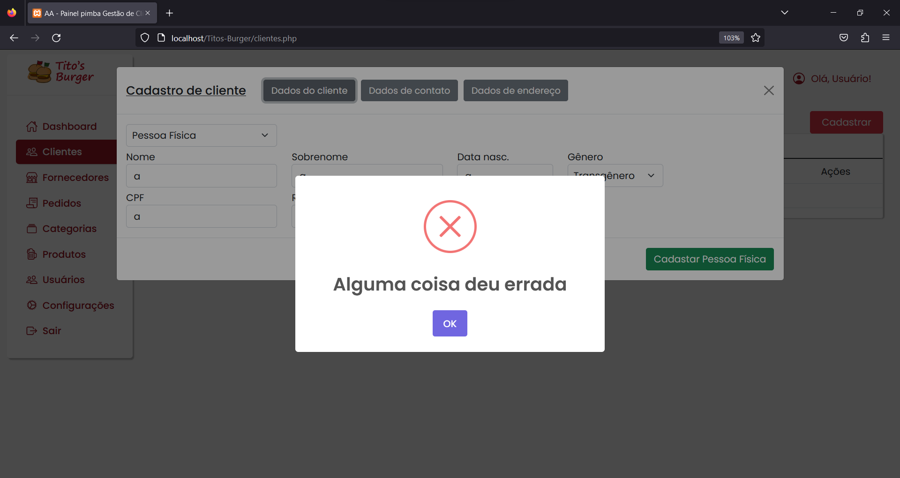
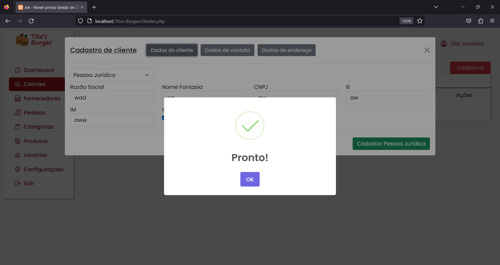

# Titos-Burger

## Sobre
Painel Administrativo para uma hamburgueria fictícia. Projeto construído junto com a minha sala e professores na parte de Back-End do meu curso técnico,
foi feita toda a Modelagem de Dados e definida as regras de negócio. Feito criptografia de informações, cadastro de clientes, fornecedores e usuários, recuperação de senha, mudanã de senha, etc.

### Conteúdos  
* [Sobre](#sobre)  
* [Tecnologias](#tecnologias)  
* [Quick Start](#quick-start)  
* [File Tree](#file-tree)  
* [Screenshots](#screenshots) 

## Tecnologias
* PHP
* MySQL
* HTML
* CSS
* Bootstrap
* JavaScript
* JQuery
* AJAX

## Quick Start
**Visualizar e Modificar**
* Baixar o repositório
* Descompactar a pasta
* Certifique-se que tenha uma versão do PHP e MySQL instalada, caso não tenha: https://www.apachefriends.org/pt_br/download.html
* Coloque a pasta do repositório na pasta criada pelo xampp "htdocs" `OS\xampp\htdocs\`
* Abra o Xampp Control Panel e inicie o Apache e MySQL 
* Na URL do navegador digite localhost/Titos-Burger/

## File Tree
```
.
├── api/
│   ├── controller/
│   │   └── validation/
│   │       └── ...
│   └── model/
│       └── ...
├── assets/
│   ├── css/
│   │   └── ...
│   ├── img/
│   │   └── ...
│   └── js/
│       └── ...
├── configs/
│   └── ...
├── cript/
│   └── ...
├── db/
│   └── ...
├── includes/
│   └── ...
├── .htaccess
├── .prettierrc
├── clientes.php
├── dashboard.php
├── fornecedores.php
├── index.php
├── recuperar-senha.html
└── usuarios.php
```

## Screenshots






